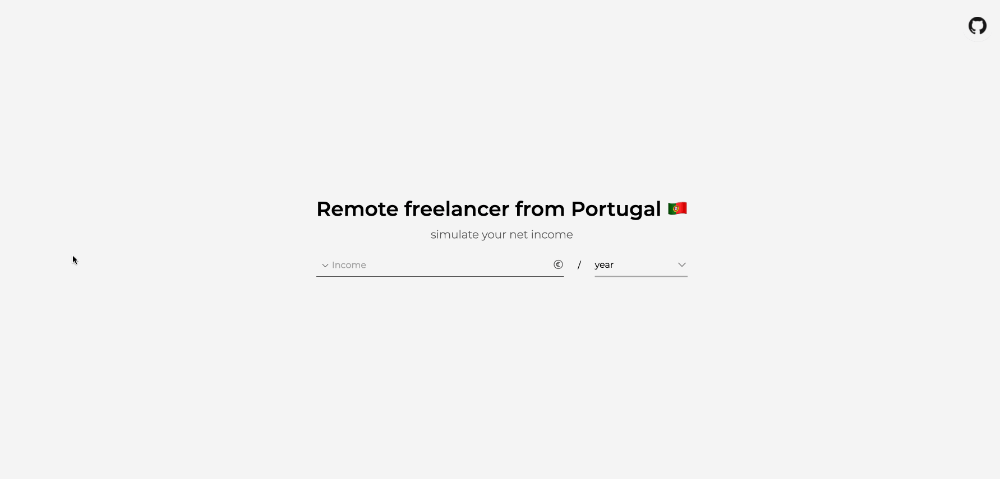

# Remote Freelancer from Portugal 🇵🇹

Simulate your earnings (year, month or day) and breakdown how much taxes you're going to pay as a freelancer working from Portugal.

live at https://freelancept.fmacedo.com/



## Contributing

Contributions are welcome. Although I enjoy helping people with their financial burdens, I do have limited time to work on this. Feel free to open an issue or submit a pull request. If you're not sure where to start, mention me in the comments!

## Local setup (with node)

### Instal dependencies

```
npm install
```

### Compiles and hot-reloads for development

```
npm run dev
```

### Compiles and minifies for production

```
npm run build
```

### Tests

**vitest**

```
npm run vitest
```

**cypress end to end**

open:

```
npm run cy:e2e:open
```

run:

```
npm run cy:e2e:run
```

## Local setup (with docker)

run as dev (with auto-reload):

```
docker compose up --build -V
```

build a production image (image named as `remotefreelancept:latest`) (listening on `:80`):

```
docker build -t remotefreelancept:latest .
```

Run tests (vitest):

```
docker build -t remotefreelancept:test --target=test .
```
