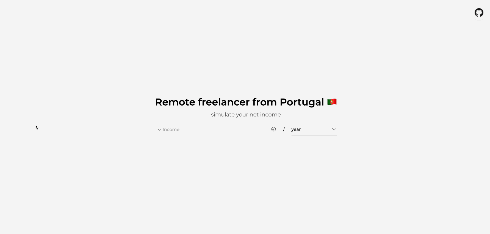

# Remote Freelancer from Portugal 🇵🇹

> **Archived — moved to [quantofica.pt](https://quantofica.pt).**
>
> This simulator has been rebuilt as **Quanto Fica**, with a redesigned UI and broader coverage (now also for dependent workers).
>
> - **App:** https://quantofica.pt
> - **Calculation library (open source):** https://github.com/franciscobmacedo/saldo

The original Vue app lives on in this repo's history for reference. Issues and PRs are closed; please open them on [`saldo`](https://github.com/franciscobmacedo/saldo) (logic) or [contact me directly](https://fmacedo.com/about/) for [quantofica.pt](https://quantofica.pt) (UI).

## Original description

Simulator for freelancers working for foreign companies while living in Portugal. Estimate your net income and taxes to pay.

## License

MIT — see [LICENSE](LICENSE).
